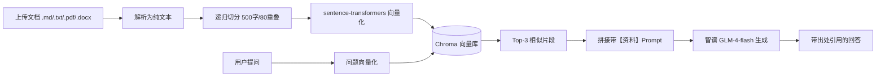
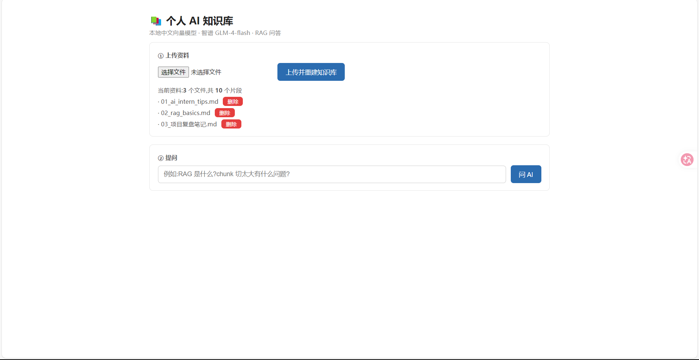
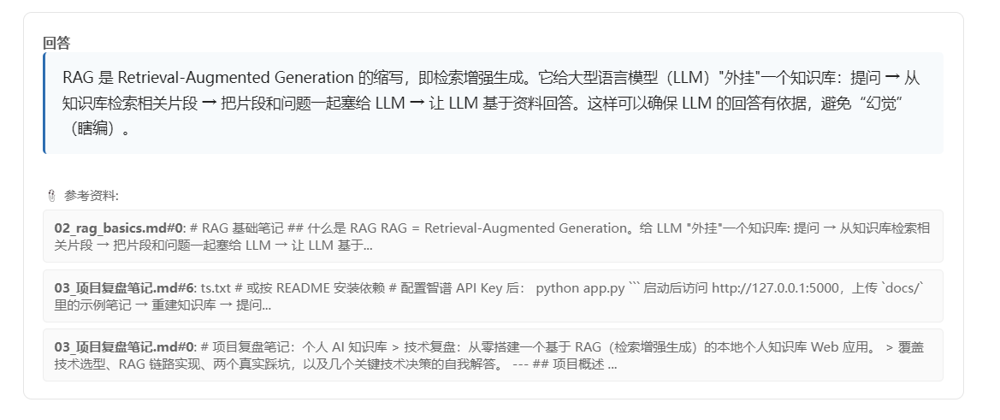

# 个人 AI 知识库 (Personal AI Knowledge Base)

> 一个基于 RAG（检索增强生成）的本地个人知识库 Web 应用：上传文档 → 自动向量化建库 → 基于资料问答并标注出处。

[](https://github.com/kk11-11/personal-ai-kb)
[📦 仓库地址](https://github.com/kk11-11/personal-ai-kb) · [💻 源代码](https://github.com/kk11-11/personal-ai-kb)

## 在线演示

本项目为**本地运行应用**（向量模型与大模型均需在本地/密钥下运行），无法提供公共在线 Demo。你可以按下方「本地运行」步骤，在 5 分钟内于自己电脑上跑起来：

```bash
git clone https://github.com/kk11-11/personal-ai-kb.git
cd personal-ai-kb
# 然后跟随「本地运行」完成 venv / 依赖 / API Key / python app.py
```

运行后访问 http://127.0.0.1:5000 即可体验：上传资料 → 提问 → 获得带出处引用的回答。

## 项目简介

本项目的目标是解决一个真实痛点：**网上收藏了无数好文章，却从未真正消化**。  
通过 RAG 技术，把个人资料（学习笔记、课程 PDF、技术文章等）变成一个"能对话的知识库"——你问任何问题，AI 会**只基于你提供的资料**给出带出处引用的回答，而不是凭空编造。

技术亮点：
- **完全本地向量化**：中文 embedding 模型（`bge-small-zh-v1.5`）在本地运行，资料不上传第三方，隐私可控。
- **二阶段检索（向量召回 + ReRank 重排）**：向量召回 Top-10 候选后，再用 `bge-reranker-base` 交叉编码器精排取 Top-3；模型缺失/失败自动降级为纯向量检索，绝不拖垮可用性。
- **多轮对话记忆**：前端维护对话历史，可结合上文理解"它/这个"等代词指代，但回答始终锚定当前问题、基于资料，避免上下文漂移。
- **用户反馈闭环**：每条回答支持 👍/👎 评分并本地落盘，便于复盘"答非所问"的分布，驱动迭代优化。
- **生产级检索链路**：递归切分 → 句向量化 → Chroma 向量库 → 检索/重排 → 大模型生成。
- **可见的溯源**：每个回答都标注了参考的「文件名#片段序号」，方便核对，避免"幻觉"。

## 技术栈

| 环节 | 技术选型 | 说明 |
|------|---------|------|
| Web 框架 | **Flask** | 轻量、易部署，便于理解请求/响应全链路 |
| 中文向量化 | **sentence-transformers + BAAI/bge-small-zh-v1.5** | 本地运行，中文检索效果优秀 |
| 向量数据库 | **Chroma (chromadb)** | 本地持久化，几行代码即可上手 |
| 大模型（生成） | **智谱 GLM-4-flash** API | 有免费额度，OpenAI 兼容协议 |
| 文档解析 | **pdfplumber** + **python-docx** + 原生 `.md/.txt` 读取 | 支持 PDF / Word / 文本 |
| 文本切分 | 手写递归切分（带重叠窗口） | 自己实现，原理清晰 |

## 目录结构

```
personal-ai-kb/
├── app.py                 # Flask Web 主程序（上传 + 问答 UI）
├── ingest.py              # 命令行：文档入库脚本
├── ask.py                 # 命令行：检索问答脚本
├── eval.py                # 检索效果与性能自评估
├── test_llm.py            # 智谱 API 连通性测试
├── verify_embedding.py    # 本地 embedding 模型加载验证
├── templates/
│   └── index.html         # 前端页面
├── docs/                  # 知识库资料（可替换为自己的内容）
├── models/
│   └── bge-small-zh-v1.5/ # 本地中文向量模型
│   └── bge-reranker-base/ # 二阶段重排模型（可选,自动降级）
└── chroma_db/             # 向量库（运行时自动生成）
```

## 环境准备

- Python ≥ 3.11
- 一个智谱大模型 API Key（注册 https://open.bigmodel.cn 免费获取）

## 本地运行

```bash
# 1. 创建并激活虚拟环境
python -m venv venv
venv\Scripts\activate          # Windows
# source venv/bin/activate     # macOS / Linux

# 2. 安装依赖
pip install -r requirements.txt

# 3. 配置智谱 API Key（仅当前终端有效）
$env:ZHIPU_API_KEY = "你的key"     # PowerShell
# export ZHIPU_API_KEY="你的key"    # bash

# 4. 启动 Web 应用
python app.py
```

浏览器打开 http://127.0.0.1:5000 即可使用：
1. 点击「选择文件」上传 `.md / .txt / .pdf / .docx` 资料（可多选）
2. 点击「上传并重建知识库」完成向量化入库
3. 在提问框输入问题，获得基于资料的回答与出处
4. 资料列表右侧的「删除」按钮可移除某份文档（仅删该来源的片段，轻量、无需全量重建）

> 也可用命令行版本：`python ingest.py`（入库）后 `python ask.py "你的问题"`。

## RAG 工作流程

```
上传文件
  → 解析为纯文本（pdfplumber / 直接读取）
  → 递归切分为带重叠的片段
  → sentence-transformers 生成句向量
  → 存入 Chroma 向量库（持久化到 chroma_db/）
        │
提问
  → 问题向量化
  → Chroma 检索 Top-K 最相关片段
  → 拼接为带【资料】标记的 Prompt
  → 智谱 GLM-4-flash 生成回答
  → 返回回答 + 来源引用
```

## 效果评估

本项目附带 `eval.py` 自评估脚本：**无需 LLM API Key 即可运行**（只评估向量检索部分），配置 `ZHIPU_API_KEY` 后会自动追加端到端延迟测试。评估方法——从知识库文档中抽取代表句作为自测问题，检验检索器能否把正确文档召回进 Top-K，作为"检索召回率"的代理指标。

在示例知识库（3 篇资料 / 10 个文本片段）上运行 `python eval.py` 的结果：

| 指标 | 结果 |
|------|------|
| 自测问题数 | 18 |
| Top-1 检索命中率 | 88.9%（16/18） |
| **Top-3 检索命中率** | **94.4%（17/18）** |
| 平均检索延迟（本地 CPU） | **10.6 ms** |
| 中文向量模型 | BAAI/bge-small-zh-v1.5（512 维，本地运行） |
| 二阶段重排模型 | BAAI/bge-reranker-base（可选，缺失则自动降级） |
| 支持格式 | .md / .txt / .pdf / .docx |

> 注：上述命中率/延迟衡量的是**向量检索环节**（Top-K 召回）的代理指标。生产问答链路在向量召回之后还额外叠加了 ReRank 二阶段重排（见「技术亮点」），会进一步精排送入大模型的片段；叠加 ReRank 会带来少量额外延迟，但能提升送入 LLM 的片段相关性。把 `docs/` 替换成你自己的资料后重跑 `python eval.py` 即可复现向量检索基线。

## 效果演示

### 问答流程图



### 界面截图

> 将下面两张截图放入仓库的 `images/` 目录后，图片会自动显示。





## Docker 部署（可选）

> **本地运行（venv）是主路径，开箱即用，不依赖 Docker。** 下面这节 Docker 部署是工程化加分项，适合想"一条命令复现整个 RAG 服务 / 上云部署"的场景。若你的环境没有 WSL2 + Docker Desktop（例如 Docker 引擎无法启动），**直接用上面的 venv 方式即可，不影响项目完整使用。**

只要装好 Docker Desktop（需 Windows 的 WSL2 后端），一条命令即可启动完整服务：

```bash
# 1. 准备密钥：复制模板并填入你的智谱 Key
cp .env.example .env
# 编辑 .env，把 ZHIPU_API_KEY 改成你的真实 key

# 2. 构建并后台启动
docker compose up --build -d

# 3. 查看日志（看到 "已启动: http://0.0.0.0:5000" 即成功）
docker compose logs -f
```

启动后访问 http://localhost:5000 即可使用。

### 卷与持久化
- `./docs`：你上传的资料，存于宿主机，重启不丢
- `./models`：中文向量模型。本地若已有 `models/bge-small-zh-v1.5` 直接挂载使用；**全新环境**首次启动会自动从 ModelScope 下载并缓存到此目录
- `./chroma_db`：向量库持久化存储，避免每次重启重建

### 常用命令
```bash
docker compose down            # 停止并移除容器
docker compose up --build      # 重新构建后启动
docker compose restart         # 重启服务
```

> 注：`.env` 含有密钥，已被 `.gitignore` 排除，不会提交到仓库；`models/`、`chroma_db/`、`venv/` 同样不进镜像与版本库。

## 后续可扩展方向

- 支持更多文件格式（网页抓取、图片 OCR）
- 切换/接入本地大模型（Ollama + Qwen），实现完全离线
- 基于用户反馈数据做针对性迭代（如用 👎 样本微调 Prompt / 扩充知识库）

> 已实现：多轮对话记忆、二阶段 ReRank 重排、用户反馈闭环（见上文「技术亮点」）。

---

_本项目为 AI 应用开发学习实践，从零搭建并完整跑通 RAG 检索链路。_
