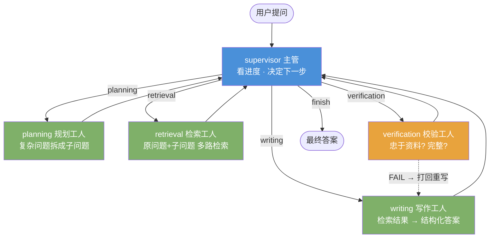

# 个人 AI 知识库 + Agent 编排系统 (Personal AI Knowledge Base)

> 一个 **RAG 检索增强** + **多 Agent 协作** 的完整 AI 应用：上传文档 → 向量化建库 → 主管 Agent 拆解问题 → 多路检索 → 专人写作 → 专人校验 → 输出带出处的可信回答。

[](https://github.com/kk11-11/personal-ai-kb)
[📦 仓库地址](https://github.com/kk11-11/personal-ai-kb) · [💻 源代码](https://github.com/kk11-11/personal-ai-kb)

## 项目简介

解决一个真实痛点：**网上收藏了无数好文章，却从未真正消化**。
通过 RAG 技术把个人资料变成"能对话的知识库"，再叠一层 **Agent 编排**：不是"问一句答一句"，而是让多个专职 Agent 分工协作完成一次问答——规划拆解、多路检索、写作、校验，不合格自动打回重写。

### 技术亮点

**检索层（RAG）**
- **完全本地向量化**：中文 embedding 模型（`bge-small-zh-v1.5`）本地运行，资料不出本机。
- **二阶段检索（向量召回 + ReRank 重排）**：向量召回 Top-10 → `bge-reranker-base` 交叉编码器精排取 Top-3；模型缺失/失败自动降级为纯向量检索。
- **多轮对话记忆**：三类指代消歧（代词 / 轮次索引 / 综合前文），超 6 轮自动摘要压缩控 token，`test_multiturn.py` 自动化验证 4/4 通过。
- **可见的溯源**：每个回答标注「文件名#片段序号」，便于核对、抑制幻觉。
- **用户反馈闭环**：👍/👎 评分本地落盘，用真实交互信号驱动迭代。

**Agent 层（本篇重点）**
- **手写 ReAct 循环**：原生 function calling 主路径 + 文本协议兜底，`max_steps` 强制收尾防无限烧 token。
- **LangGraph 框架化重写**：与手写版**同签名**替换，用状态图显式表达 ReAct 的控制流，接入 `checkpoint` 实现跨请求记忆。
- **多 Agent 编排（5 节点）**：主管调度 + 规划/检索/写作/校验四个专职工人，支持**查询分解**与**不合格打回重写**闭环。
- **工业级容错**：LLM 调度 + 规则兜底 + **幂等校验**三层防御，实测可拦截"模型重复派活导致的死循环"。

---

## Agent 架构：从手写循环到多 Agent 协作

项目里 Agent 能力是**分三层演进**的，每层都保留了可运行代码，便于对照理解：

| 阶段 | 文件 | 做了什么 | 关键价值 |
|------|------|---------|---------|
| ① 手写 ReAct | `agent.py` | 自己写 `for` 循环 + `if` 分支实现 Thought→Action→Observation | 理解框架到底替你做了什么 |
| ② 框架化重写 | `langgraph_agent.py` | 用 LangGraph 状态图重写，`add_messages` reducer + 条件边 + `MemorySaver` | 控制流可视化、状态可持久化/可回溯 |
| ③ 多 Agent 编排 | `multi_agent.py` | 主管 + 四个专职工人协作 | 复杂问题拆解、多路检索、质量校验闭环 |

> 概念对照与面试讲述要点见 [`LANGGRAPH_NOTES.md`](LANGGRAPH_NOTES.md)。

### 多 Agent 协作流程（③ 的完整架构）



**设计要点**
- **查询分解（query decomposition）**：复杂问题先拆成最多 3 个子问题，再逐条检索。单个问题往往覆盖不全知识库里的多个角度，拆开检索显著提升召回覆盖。
- **多路检索合并**：原问题 + 各子问题分别跑 RAG ReAct 循环，结果带 `【原问题】/【子问题: x】` 标签合并，避免信息混淆。
- **自纠错闭环**：校验工人判 `FAIL` → 主管打回写作重写，最多 2 次（`MAX_REWRITE`），防止无限循环。
- **职责分离**：主管只管调度与纠错，不碰业务逻辑；检索/写作/校验各司其职，任一环节可单独替换或测试。

### 工程防御：实测踩过的坑

这一节是这套系统**最真实的部分**——每个条目都对应一次真实崩溃后的修复：

| 问题 | 现象 | 修复 |
|------|------|------|
| 智谱 `tool_choice` 兼容性 | 强制指定函数工具调用时，glm-4-flash 直接返回纯文本（`tool_calls=None`），代码 `tool_calls[0]` 抛 `TypeError` | 改用 `tool_choice="auto"` + 三层容错解析（tool_calls → 文本关键词 → 规则兜底） |
| **主管重复派活死循环** | 复杂问题下主管连续 10 次决策 `planning`，检索从未执行，最终答案为空 | 引入 `last_worker` 追踪 + `_is_valid()` **幂等校验**：决策与当前进度冲突时用规则路由纠正 |
| API Key 占位符 | `.env` 存中文占位符时，HTTP 请求头构建抛 `UnicodeEncodeError`，错误信息完全看不懂 | 启动时 `isascii()` 校验，用人话提示"请填入真实 key" |
| 空答案不可排查 | 流程异常中断时返回空字符串，无从定位 | 三级兜底：`draft` → `retrieval`（标注"未经整理"）→ 明确错误信息 |

**核心设计原则**：LLM 做"调度优化"，规则做"正确性底线"。模型可以给出糟糕的建议，但系统永远不会因此崩溃或空转。

### 验证方式

- **Mock 测试**（`test_multi_agent_mock.py`，不消耗 API）：6 个场景覆盖标准流程 / 打回重写 / 重写次数护栏 / 规则兜底接管 / 规划+多路检索 / 死循环拦截。
- **真实运行**：
  ```bash
  python multi_agent.py "对比一下这个项目的 RAG 检索流程和上下文压缩机制"
  ```
  会打印完整协作轨迹，每一步标注是哪个工人在干活、用什么方式决策。

---

## 技术栈

| 环节 | 技术选型 | 说明 |
|------|---------|------|
| Web 框架 | **Flask** | 轻量、易部署 |
| Agent 编排 | **LangGraph** + langchain-core | 状态图 + checkpoint + 条件边 |
| 中文向量化 | **sentence-transformers + BAAI/bge-small-zh-v1.5** | 本地运行，512 维 |
| 二阶段重排 | **BAAI/bge-reranker-base** | 交叉编码器精排，可降级 |
| 向量数据库 | **Chroma (chromadb)** | 本地持久化 |
| 大模型（生成） | **智谱 GLM-4-flash** API | OpenAI 兼容协议，有免费额度 |
| 文档解析 | **pdfplumber** + **python-docx** + 原生读取 | PDF / Word / 文本 |
| 文本切分 | 手写递归切分（带重叠窗口） | 自己实现，原理清晰 |

## 目录结构

```
personal-ai-kb/
├── app.py                  # Flask Web 主程序（上传 + 问答 UI）
├── agent.py                # ① 手写 ReAct 循环（function calling + 文本兜底）
├── langgraph_agent.py      # ② LangGraph 单 Agent 重写（与①同签名）
├── multi_agent.py          # ③ 多 Agent 编排（主管 + 规划/检索/写作/校验）
├── LANGGRAPH_NOTES.md      # 手写 ReAct ↔ LangGraph 概念对照与面试要点
├── ingest.py               # 命令行：文档入库
├── ask.py                  # 命令行：检索问答
├── eval.py                 # 检索效果与性能自评估
├── history_retrieval.py    # 多轮对话历史与指代消歧
├── test_multiturn.py       # 多轮指代消歧自动化验证
├── test_longcontext_compare.py  # 长上下文压缩策略对比
├── test_llm.py             # 智谱 API 连通性测试
├── verify_embedding.py     # 本地 embedding 模型加载验证
├── templates/index.html    # 前端页面
├── DEPLOY.md               # 部署说明
├── docs/                   # 知识库资料（可替换为自己的内容）
├── models/                 # bge-small-zh-v1.5 / bge-reranker-base
└── chroma_db/              # 向量库（运行时自动生成）
```

## 环境准备

- Python ≥ 3.11
- 一个智谱大模型 API Key（注册 https://open.bigmodel.cn 免费获取）

## 本地运行

```bash
# 1. 创建并激活虚拟环境
python -m venv venv
venv\Scripts\activate          # Windows
# source venv/bin/activate     # macOS / Linux

# 2. 安装依赖
pip install -r requirements.txt

# 3. 配置智谱 API Key
cp .env.example .env
#   编辑 .env，把 ZHIPU_API_KEY 改成你的真实 key（已是 .gitignore 保护，不会入库）
#   或仅当前终端生效： $env:ZHIPU_API_KEY = "你的key"

# 4. 启动 Web 应用
python app.py
```

浏览器打开 http://127.0.0.1:5000：
1. 上传 `.md / .txt / .pdf / .docx` 资料（可多选）
2. 点击「上传并重建知识库」完成向量化
3. 提问，获得基于资料的回答与出处
4. 资料右侧「删除」可移除单份文档（按 `source` 元数据增量删除，无需全量重建）

> 也支持命令行：`python ingest.py`（入库）后 `python ask.py "你的问题"`。

### 单独体验 Agent 能力

```bash
python langgraph_agent.py "这个项目的上下文压缩是怎么做的?"   # 单 Agent ReAct，打印每步轨迹
python multi_agent.py "对比 RAG 检索流程和上下文压缩机制"      # 多 Agent 协作，打印分工轨迹
```

## RAG 工作流程

```
上传文件
  → 解析为纯文本（pdfplumber / 直接读取）
  → 递归切分为带重叠的片段（500 字符 / 80 重叠）
  → sentence-transformers 生成句向量
  → 存入 Chroma 向量库（持久化到 chroma_db/）
        │
提问
  → 【多 Agent 模式】规划拆解 → 多路检索
  → 问题向量化 → Chroma 检索 Top-K → ReRank 精排 Top-3
  → 拼接为带【资料】标记的 Prompt
  → 智谱 GLM-4-flash 生成 → 校验工人核验
  → 返回回答 + 来源引用
```

## 效果评估

`eval.py` 自评估脚本：**无需 LLM API Key 即可运行**（只评估向量检索部分），配置 key 后自动追加端到端延迟测试。

在示例知识库（3 篇资料 / 10 个文本片段）上的结果：

| 指标 | 结果 |
|------|------|
| 自测问题数 | 18 |
| Top-1 检索命中率 | 88.9%（16/18） |
| **Top-3 检索命中率** | **94.4%（17/18）** |
| 叠加 ReRank 精排后 | 100% |
| 平均检索延迟（本地 CPU） | **10.6 ms** |
| 支持格式 | .md / .txt / .pdf / .docx |

> **诚实说明**：当前基线只有 18 个自测问题、3 篇示例资料，样本量偏小，属于"能跑通并量化"的起点而非充分验证。把 `docs/` 替换成你自己的资料后重跑 `python eval.py`，即可得到对应语料的真实基线——这也是把它当回归测试用的正确姿势。

## 效果演示

### 界面截图


## Docker 部署（可选）

> 本地 venv 运行是主路径，开箱即用、不依赖 Docker。本节适合"一条命令复现整个服务 / 上云部署"。

```bash
# 1. 准备密钥
cp .env.example .env      # 编辑 .env 填入真实 key

# 2. 构建并后台启动
docker compose up --build -d

# 3. 查看日志（看到 "已启动: http://0.0.0.0:5000" 即成功）
docker compose logs -f
```

启动后访问 http://localhost:5000。

### 卷与持久化
- `./docs`：上传的资料，存于宿主机，重启不丢
- `./models`：中文向量模型，全新环境首次启动会自动从 ModelScope 下载缓存
- `./chroma_db`：向量库持久化，避免每次重启重建

> `.env` 含密钥，已被 `.gitignore` 排除；`models/`、`chroma_db/`、`venv/` 同样不进版本库与镜像。

## 后续方向

- **自进化闭环**：把 👎 反馈样本自动归类为失败模式（召回失败 / 切分不当 / 答案不完整），定向调整检索参数后用 `eval.py` 验证是否改善
- 接入本地大模型（Ollama + Qwen）实现完全离线
- 支持更多格式（网页抓取、图片 OCR）
- 前端升级：展示多 Agent 协作轨迹，让"黑盒"变"白盒"

---

_从零设计并实现的 RAG + Agent 系统：手写 ReAct 循环、LangGraph 框架化重写、多 Agent 编排协作三层演进，含检索评估与工程容错，已开源可复现。_
